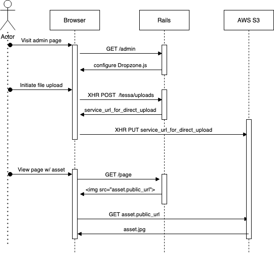

# [Tessa Client][0]

[ ![Gem Version][1]     ][2]
[ ![Build Status][3]    ][4]
[ ![Coverage Status][5] ][6]
[ ![Code Climate][7]    ][8]

This gem wraps ActiveStorage to provide some convenience helpers for direct uploading
assets, as well as generating public and private asset URLs.

## History

This gem was initially conceived as a client to the
[Tessa asset management service](https://github.com/watermarkchurch/tessa).  That service has been deprecated and is
being phased out.

In 2022, we moved away from using Tessa to manage our assets and got onto the official Rails ActiveStorage library.
[Here is the issue tracking the effort](https://github.com/watermarkchurch/tessa/issues/27).  As part of that process,
we released the v1.x version of this gem which supports both ActiveStorage and Tessa but uploads all new assets to
ActiveStorage.

When that migration is completed, v2.x of this gem will remove all code that accesses the old Tessa service.  This gem
will transition to being simply a convenience wrapper around ActiveStorage, so that we don't have to re-write as much
of our code in our frontend apps.

## Installation

Add this line to your application's Gemfile:

```ruby
gem 'tessa'
```

And then execute:

    $ bundle

Or install it yourself as:

    $ gem install tessa

## Usage

We provide no guarantee of support for your use of this gem.  It is for internal Watermark use only.
**Use at your own risk!**

The main thing this gem still gives us is direct-uploads using [Dropzone.js](https://github.com/dropzone/dropzone).
Before using this gem it's worthwhile to understand how it works:



When an Asset input is configured using the SimpleForm helper (TODO: https://github.com/watermarkchurch/tessa-client/issues/22),
it creates a DropZone div with the css class `.tessa-upload`.  The javascript
in `app/javascript/tessa/index.js.coffee` scans for these divs and configures
Dropzone.js.

When a user initiates a file upload via Dropzone, it does an XHR POST to `/tessa/uploads`.  This triggers
the `lib/tessa/rack_upload_proxy.rb` middleware to create a new ActiveStorage blob, and returns the
signed upload URL.  Dropzone then uploads the file directly to S3 (or wherever ActiveStorage is configured)
from the user's browser.

To get all this working, follow these steps:

1. Mount the engine
in your `config/routes.rb`, `mount Tessa::Engine, at: '/'`.  It's important that it is mounted at root.

You can use Authentication around the engine to prevent unauthorized uploads.  With devise it's as simple as:
```rb
  authenticated :user do
    mount Tessa::Engine, at: '/'
  end
```

2. In your application.js, require the js libraries:
```js
//= require dropzone
//= require tessa
```
Note that this only works if you are using Sprockets.
If you are using another bundler, we don't support that yet.

3. In your model, use the Tessa `asset` declaration instead of `has_one_attached`.  The SimpleForm helper only works
     with Tessa `asset` declarations so far.

```rb
class Model < ApplicationRecord
    include Tessa::Model 

  asset :image # Note: this essentially delegates to has_one_attached
```

4. When rendering your form, use the SimpleForm helper to render the dropzone div:

```erb
<%= f.input :image,
    as: :asset,
    dropzone: { acceptedFiles: "image/*" },
    hint: "Use an image that is 1440 x 288 in size (5:1 aspect ratio)" %>
```

5. Configure your ActiveStorage service to accept direct uploads.
    The disk service does this automatically.  The S3 service requires additional CORS configuration.

## Contributing

1. Fork it ( https://github.com/watermarkchurch/tessa/fork )
2. Create your feature branch (`git checkout -b my-new-feature`)
3. Commit your changes (`git commit -am 'Add some feature'`)
4. Push to the branch (`git push origin my-new-feature`)
5. Create a new Pull Request

  [0]: https://github.com/watermarkchurch/tessa-client
  [1]: https://img.shields.io/gem/v/tessa.svg?style=flat
  [2]: http://rubygems.org/gems/tessa "Gem Version"
  [3]: https://img.shields.io/travis/watermarkchurch/tessa-client/master.svg?style=flat
  [4]: https://travis-ci.org/watermarkchurch/tessa-client "Build Status"
  [5]: https://api.codeclimate.com/v1/badges/14600955bbe143bee625/test_coverage
  [6]: https://codeclimate.com/github/watermarkchurch/tessa-client/test_coverage "Coverage Status"
  [7]: https://api.codeclimate.com/v1/badges/14600955bbe143bee625/maintainability
  [8]: https://codeclimate.com/github/watermarkchurch/tessa-client/maintainability "Code Climate"
